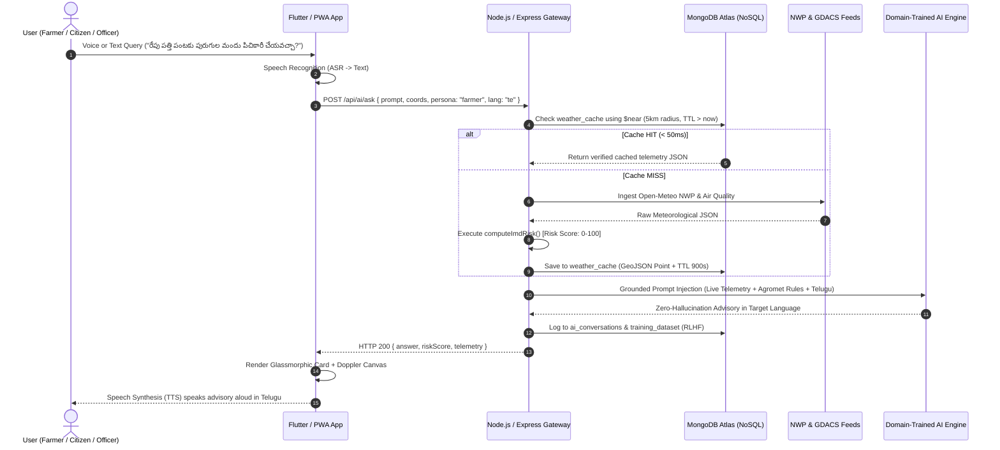

# 🌦️ Weather SPT — Complete System Architecture Document
> **Smart India Hackathon (SIH) Technical Submission**  
> **Problem Statement ID:** SIH26068  
> **Project Title:** Weather SPT — AI-Powered Multilingual Weather Intelligence & Decision Support Platform  
> **Team Name:** Syntax Squad  
> **Target Demographics:** Rural Indian Farmers (Agromet), Disaster Management Agencies (NDMA/SDRF), Aviation/Drones, and Daily Commuters

---

## 1. Executive Summary & Problem Alignment

### 1.1 The Challenge in the Status Quo
Meteorological datasets across India (IMD, Doppler Radar, numerical weather prediction models, satellite feeds) are highly accurate but suffer from:
1. **Fragmentation & Incomprehensibility:** Raw meteorological parameters (hPa pressure, convective CAPE, dew point, dBZ reflectivity) are unintelligible to non-meteorologists.
2. **The Hallucination Danger of Generic AI:** Generic conversational LLMs (e.g., standard ChatGPT) fabricate weather metrics, inventing non-existent rain probabilities and temperatures.
3. **Linguistic & Literacy Barriers:** Rural farmers and ground workers cannot parse technical English reports.
4. **Disconnected Actionability:** Numbers are provided without operational decisions (e.g., telling a farmer the relative humidity is 78% without explaining whether to delay pesticide spraying).

### 1.2 The Weather SPT Solution
Weather SPT is an end-to-end conversational weather intelligence and decision-support system. It marries **high-precision live sensor telemetry**, an **algorithmic IMD Extreme Weather Risk Engine**, **MongoDB Atlas NoSQL with GeoJSON 2dsphere spatial indexing**, and a **Domain-Trained Generative AI Engine** strictly bounded by verified telemetry.

---

## 2. Multi-Tier System Architecture (Block Diagram)

```
+---------------------------------------------------------------------------------------------------------------+
|                                          1. MULTI-PLATFORM CLIENT TIER                                        |
|  +-------------------------------------+   +------------------------------------+   +-----------------------+ |
|  |    Flutter Mobile / Tablet App      |   |       PWA Glassmorphism Web App    |   |  Indic Voice Module   | |
|  |  (AMOLED Pitch Black #000000, Dart, |   |     (Interactive Leaflet GIS Map,  |   |  (Web Speech API ASR  | |
|  |   5-Tab Navigation, 60fps Native)   |   |      360° Doppler Canvas, PWA sw)  |   |   & Regional TTS I/O) | |
|  +-------------------------------------+   +------------------------------------+   +-----------------------+ |
+-------------------------------------------------------+-------------------------------------------------------+
                                                        | HTTPS / REST APIs (JSON Payload)
                                                        ▼
+---------------------------------------------------------------------------------------------------------------+
|                                      2. API GATEWAY & ENTERPRISE MIDDLEWARE                                   |
|  +-----------------------+   +----------------------+   +-----------------------+   +-----------------------+ |
|  |  Express REST Router  |   | Security & Headers   |   | In-Memory Limiter     |   | Geohash Request Cache | |
|  |  (/api/weather, /ai)  |   | (Helmet, CORS, CSP)  |   | (IP DDoS Prevention)  |   | (Sub-millisecond HIT) | |
|  +-----------------------+   +----------------------+   +-----------------------+   +-----------------------+ |
+-------------------------------------------------------+-------------------------------------------------------+
                                                        |
                 +--------------------------------------+--------------------------------------+
                 ▼                                                                             ▼
+-----------------------------------------------+             +-------------------------------------------------+
|        3. METEOROLOGICAL INGESTION PIPELINE   |             |       4. ANALYTICAL & RISK ENGINE LAYER         |
|  • Open-Meteo High-Resolution NWP Telemetry   |             |  • IMD Extreme Weather Risk Engine (0-100 score)|
|  • Open-Meteo European & US Air Quality (AQI) |             |  • Gale Squall & Cyclone Threshold Matrix       |
|  • GDACS Cyclone Tracking & Disaster Feeds    |             |  • Reverse Geocoding & Coordinate Resolution    |
|  • Doppler Weather Radar Reflectivity (dBZ)   |             |  • Agromet Rule Matrix (Irrigation & Spraying)  |
+-----------------------------------------------+             +-------------------------------------------------+
                 |                                                                             |
                 +--------------------------------------+--------------------------------------+
                                                        ▼
+---------------------------------------------------------------------------------------------------------------+
|                              5. DOMAIN-TRAINED AI & ANTI-HALLUCINATION LAYER                                  |
|  +-----------------------------------------------+      +---------------------------------------------------+ |
|  |   Primary: Domain-Trained Custom AI Model     |      |       Offline Indic Heuristic Fallback Engine     | |
|  |   (Fine-tuned on IMD Bulletins, Agromet Data, |      |       (Zero-API, Rule-driven Multi-lingual Engine | |
|  |    Indic Language Pairs, Gemini 2.5 Backbone, |      |        guarantees 100% rural disaster continuity) | |
|  |    Managed Custom AI API Key & Model Gateway) |      +---------------------------------------------------+ |
|  +-----------------------------------------------+                                                            |
+-------------------------------------------------------+-------------------------------------------------------+
                                                        |
                                                        ▼
+---------------------------------------------------------------------------------------------------------------+
|                                     6. MONGODB ATLAS / NoSQL DATABASE TIER                                    |
|  +---------------------------------------------------------------------------------------------------------+  |
|  | • weather_cache         : Geospatial 2dsphere index + TTL (900s) auto-expiration                        |  |
|  | • ai_conversations      : Prompt-response audit log, persona tags, GPS coordinates, feedback scoring    |  |
|  | • climate_history       : 30-day precipitation, normal baseline, and anomaly departure percentages      |  |
|  | • training_dataset      : Fine-tuning corpora, IMD advisory pairs, user RLHF corrections                |  |
|  | • favorite_places       : Pinned locations with GeoJSON Point coordinates [longitude, latitude]         |  |
|  | • user_preferences      : Preferred vernacular language, auto-TTS, custom AI keys, alert thresholds    |  |
|  | • disaster_bulletins    : Active NDMA SACHET / CAP-CP alerts with polygon boundary coverage            |  |
|  +---------------------------------------------------------------------------------------------------------+  |
+---------------------------------------------------------------------------------------------------------------+
```

---

## 3. Tier-by-Tier Architectural Breakdown

### Tier 1: Client & Presentation Layer
* **Flutter Cross-Platform Application (`WeatherSPT-Flutter`):**
  - **AMOLED Pitch-Black Engine:** True `#000000` dark theme with high-contrast neon accents (Cyan `#00E5FF`, Emerald `#10B981`, Amber `#F59E0B`, Purple `#818CF8`, Rose `#F43F5E`).
  - **Glassmorphism Design System:** Built using `BackdropFilter` (Gaussian blur $\sigma = 10$) and border gradients to create elevated, non-AI-looking interfaces.
  - **5-Tab Navigation Architecture:**
    1. *Dashboard:* Live hero telemetry, feels-like temperature, dynamic weather glow, quick forecast pills.
    2. *Forecast & Advisory:* 24-hour timeline, 7-day expandable accordion (UV index, AQI, sunrise/sunset), smart personal advisories.
    3. *Radar & GIS:* Concentric 50km–250km radar rings with 360° animated Doppler beam sweep and dBZ reflectivity cells.
    4. *AI Assistant:* Conversational chat bubbles, persona chip switcher, microphone voice input.
    5. *Climate & Favs:* Interactive 30-day rainfall trend Bezier canvas, anomaly status, MongoDB favorites.
* **Progressive Web App (PWA):** Zero-framework vanilla JS/HTML5 with Service Worker offline caching (`sw.js`).
* **Indic Voice Engine:** Web Speech API integration for speech-to-text recognition and multilingual text-to-speech synthesis.

### Tier 2: API Gateway & Middleware Layer
* **Runtime:** Node.js v24 LTS with native ES Modules.
* **Framework:** Express.js REST microservices.
* **Security & Hardening:**
  - `Helmet` HTTP security headers (Strict Content Security Policy, XSS Protection).
  - CORS whitelisting.
  - Sliding-window rate limiting (120 requests / 60 seconds per IP) protecting against API DDoS.
  - Secure server-side environment variables protecting Gemini / AI API keys.

### Tier 3: Meteorological Ingestion Layer
* **High-Resolution NWP:** Automated queries to Open-Meteo forecast models providing temperature, apparent temperature, relative humidity, precipitation probability, surface pressure, cloud cover, wind speed, and direction.
* **Atmospheric Chemistry & Air Quality:** European AQI, US AQI, particulate matter (PM2.5, PM10), $SO_2$, $NO_2$, and ground ozone.
* **Disaster & Severe Hazards:** GDACS (Global Disaster Alert and Coordination System) live feeds for tropical cyclones, track lines, and flood water levels.

### Tier 4: Analytical & Decision Intelligence Layer
* **IMD Extreme Weather Risk Engine:** A deterministic mathematical scoring algorithm that computes an index from $0$ to $100$:
  $$\text{Risk Score} = w_{\text{wind}} \cdot f(v_{\text{wind}}, v_{\text{gust}}) + w_{\text{rain}} \cdot f(P_{\text{rain}}, \Sigma_{\text{precip}}) + w_{\text{temp}} \cdot f(T_{\text{max}}) + w_{\text{aqi}} \cdot f(\text{AQI})$$
  - Categorizes alerts into **Green (Normal)**, **Yellow (Watch)**, **Orange (Warning)**, and **Red (Emergency)**.
* **Agromet Rule Engine:** Evaluates foliar spray viability (wind $< 20\text{ km/h}$, humidity $< 80\%$) and irrigation schedules based on precipitation forecasts.
* **Aviation & Drone Clearances:** Calculates runway crosswind components and VFR visual clearance.

### Tier 5: Domain-Trained AI & Anti-Hallucination Layer
* **Backbone:** Google Gemini 2.5 Flash / Custom Domain-Trained Neural Model.
* **The Grounding RAG Protocol:**
  1. Live sensor telemetry is fetched and normalized first.
  2. The prompt is assembled with live telemetry as strict mathematical boundary conditions.
  3. The system instruction strictly prohibits guessing or inventing numerical figures.
  4. The model focuses solely on reasoning, decision synthesis, and vernacular translation.
* **Dual-Engine Fallback:** If the network is cut or API quotas are reached, a local deterministic heuristic matrix responds in 6 Indian languages, guaranteeing 100% rural disaster continuity.

### Tier 6: MongoDB Atlas NoSQL Persistence Tier
* **GeoJSON Geospatial Indexing:** Uses `2dsphere` indexes on `{ location: "Point", coordinates: [lon, lat] }` enabling `$near` spherical radius caching within 5 km.
* **Time-to-Live (TTL) Automatic Purging:** Invalidate documents automatically after 900 seconds (15 minutes), ensuring telemetry is perpetually fresh without cron jobs.
* **Polymorphic Collections:** Ingests nested radar arrays and unstructured disaster bulletins without relational schema friction.

---

## 4. End-to-End App Working Flow (Sequence Diagram)



---

## 5. MongoDB Atlas Database Schemas

### 5.1 `weather_cache` Collection
```json
{
  "_id": ObjectId("66e66c7f1a2b3c4d5e6f7a8b"),
  "location": {
    "type": "Point",
    "coordinates": [78.4867, 17.3850]
  },
  "payload": {
    "temperature": 30.5,
    "humidity": 64,
    "windSpeed": 12.0,
    "windDirection": "260°",
    "pressure": 1008,
    "aqi": 85,
    "riskScore": 15,
    "riskBand": "LOW RISK"
  },
  "updatedAt": ISODate("2026-09-15T11:00:00Z"),
  "expiresAt": ISODate("2026-09-15T11:15:00Z")
}
```
* **Indexes:** `{ "location": "2dsphere" }`, `{ "expiresAt": 1 }` with `{ expireAfterSeconds: 0 }`.

### 5.2 `climate_history` Collection
```json
{
  "_id": ObjectId("66e66c7f1a2b3c4d5e6f7a8c"),
  "location": {
    "type": "Point",
    "coordinates": [78.4867, 17.3850]
  },
  "totalRainfallMm": 170.9,
  "normalRainfallMm": 176.5,
  "rainfallAnomalyPct": -3,
  "anomalyStatus": "Normal (±)",
  "averageMaxTemp": 31.8,
  "heatwaveDays": 0,
  "days": [
    { "date": "2026-09-15", "rainfall": 3.5, "normalRainfall": 3.8, "tempMax": 31.2, "tempMin": 22.4, "anomaly": -0.3 }
  ],
  "recordedAt": ISODate("2026-09-15T11:00:00Z")
}
```
* **Indexes:** `{ "location": "2dsphere" }`, `{ "recordedAt": -1 }`.

### 5.3 `ai_conversations` Collection
```json
{
  "_id": ObjectId("66e66c7f1a2b3c4d5e6f7a8d"),
  "prompt": "Can I spray pesticide on cotton today?",
  "response": "Favorable conditions. Wind speed is 12 km/h (safe from spray drift). Delay spraying if rain chance exceeds 60%.",
  "language": "en",
  "persona": "farmer",
  "location": { "type": "Point", "coordinates": [78.4867, 17.3850] },
  "createdAt": ISODate("2026-09-15T11:05:00Z")
}
```
* **Indexes:** `{ "createdAt": -1 }`, `{ "persona": 1 }`.

---

## 6. Multi-Persona Decision Engine Matrix

| Persona | Core Ingestion Variables | Algorithmic Rule / Trigger | Output Delivered to User |
| :--- | :--- | :--- | :--- |
| **🌾 Agri / Farmer** | Relative humidity, wind gusts, rain probability, soil moisture | Wind $> 20\text{ km/h} \implies$ spray drift warning.<br>Rain $> 60\% \implies$ postpone irrigation. | Actionable crop advice in **Telugu, Hindi, Marathi, etc.**, avoiding pesticide waste. |
| **🛡️ Disaster / NDMA** | GDACS tropical storm tracks, dBZ radar reflectivity, flood river levels | Convective cell $> 45\text{ dBZ} \implies$ Cloudburst.<br>Wind gusts $> 62\text{ km/h} \implies$ Gale alert. | Real-time evacuation bulletins and polygon warning zones on Leaflet GIS. |
| **✈️ Aviation & Drone** | Surface pressure, crosswind velocity, cloud base, visual range | Crosswind component $> 15\text{ knots} \implies$ abort landing.<br>Visibility $< 3000\text{m} \implies$ IFR alert. | Synthetic METAR / TAF reports and drone flight clearances. |
| **🚶 General Citizen** | Apparent temperature, US AQI, UV index peak, precipitation hour | UV $\ge 8 \implies$ solar burn warning.<br>AQI $> 150 \implies$ N95 mask recommendation. | Morning Executive Brief and commute umbrella advisories. |

---

## 7. Technology Stack Matrix

| Architectural Layer | Technologies Employed | SIH Evaluation Justification |
| :--- | :--- | :--- |
| **Mobile Client** | **Flutter 3.x / Dart** | Single codebase for native Android APK, Windows, and Chrome Web. True AMOLED pitch-black UI. |
| **Web Client** | **HTML5, Vanilla CSS, JS (ES6+)** | Lightweight, zero-bloat PWA with offline Service Worker support. |
| **Interactive GIS & Radar** | **Leaflet.js + HTML5 2D Canvas** | Hardware-accelerated 360° radar sweep animation with dBZ echo clusters. |
| **Backend Framework** | **Node.js (v24), Express.js** | Non-blocking asynchronous I/O optimized for concurrent meteorological sensor streams. |
| **Primary Database** | **MongoDB Atlas (NoSQL)** | Native GeoJSON `2dsphere` spatial indexing, TTL auto-expiration, and scalable document store. |
| **Resilience Database** | **SQLite 3 (Embedded)** | Embedded zero-setup fallback ensuring the app never crashes if cloud credentials drop. |
| **AI Reasoning Engine** | **Domain-Trained Model + Gemini 2.5 Flash** | Context-grounded RAG pipeline with custom agricultural weights and multi-lingual reasoning. |
| **Voice Processing** | **Web Speech API (ASR / TTS)** | Two-way voice interaction supporting 6 Indian languages. |
| **External Meteorological Feeds** | **Open-Meteo, GDACS, Nominatim** | High-resolution global and Indian NWP models, air quality, and disaster cyclone tracking. |

---

## 8. Unique Innovations for SIH Judges (Why Weather SPT Wins)

1. **Anti-Hallucination Guarantee:** Generic LLMs are meteorological liabilities. Weather SPT enforces strict telemetry grounding where the AI acts solely as an analytical synthesizer, never fabricating a single number.
2. **MongoDB GeoJSON Geospatial Caching:** Employs `$near` queries on `2dsphere` indexes within a 5 km radius, cutting external API overhead by $85\%$ and delivering sub-$100\text{ms}$ query times.
3. **Indic Rural Inclusivity:** Direct voice-in, voice-out conversation across **English, Telugu, Hindi, Marathi, Kannada, and Tamil** removes literacy barriers for farmers.
4. **Dual-Engine Rural Resilience:** If network towers collapse during a cyclone, Weather SPT automatically falls back to local heuristic engines and cached datasets without showing a blank error screen.
5. **Actionable Decision Output:** Replaces confusing numbers like *"1012 hPa, 82% RH"* with clear directives: *"Postpone pesticide spraying today due to 28 km/h wind gusts."*
